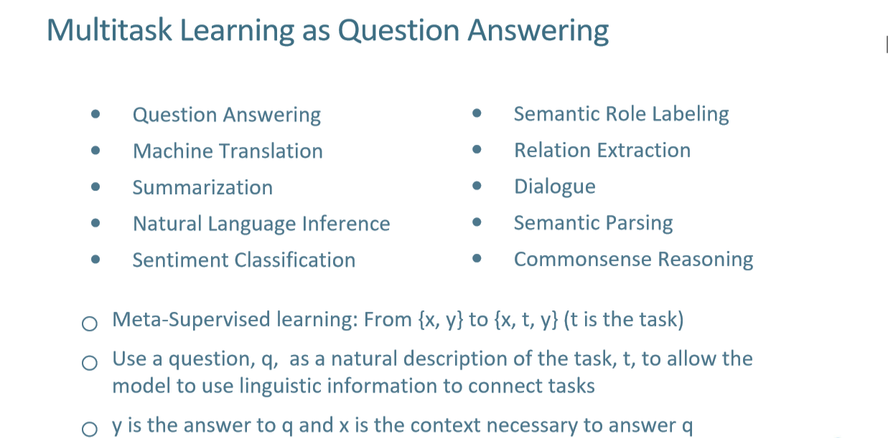
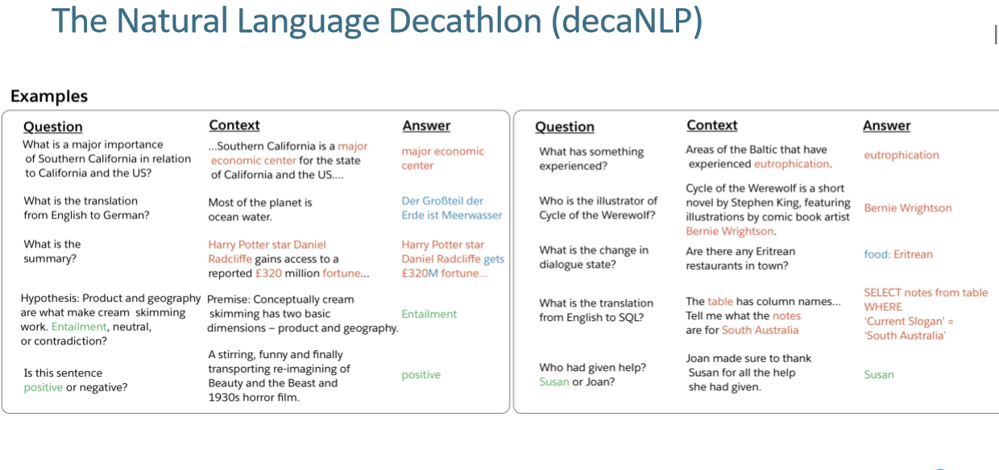
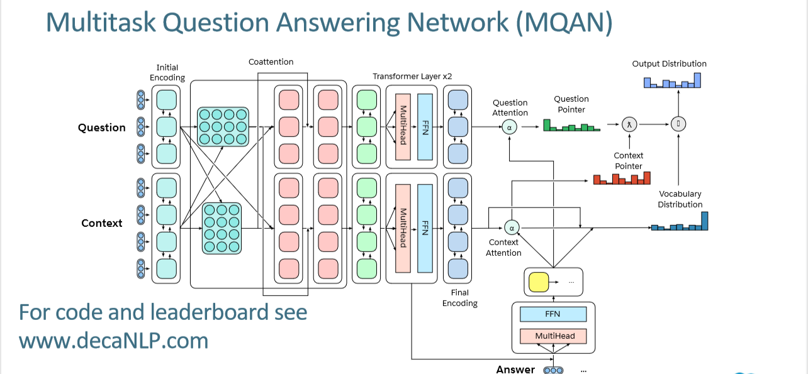
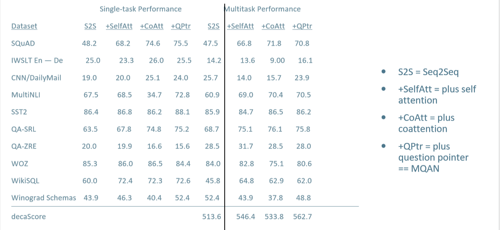
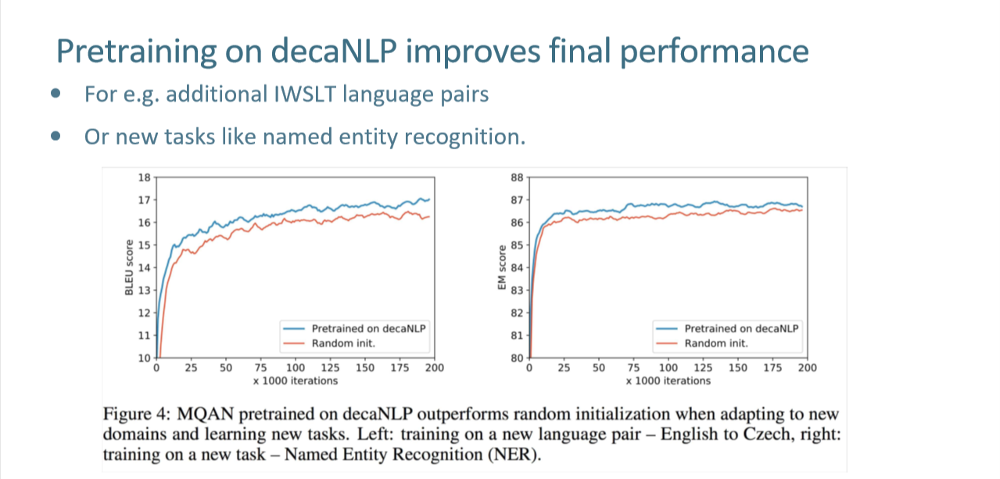

# 一 引言

 近几年在数据集，任务，模型，度量等方面上有很大提高。只要数据集够大，模型就可以达到局部最优，我们从单个模型中学习，模型通常由随机或部分预训练开始。一般如果你拥有的输出类数量的1,000倍，效果可能达到准确率高达80％到90％，如ImageNet中，有1000个不同的计算机视觉课程，
1,000个不同的类，每个类有1,000个图像。因此，如果有大约一百万张图像，那么效果显著。但在机器翻译中，理想情况下，有几十万字，每个单词的数百万个例子，却是不适用的。

单个nlp模型集中于单个模型的度量和任务完成，不能形成典范。为了统一的模型，我们引入了NLP通用模型自然语言十项全能(decaNLP)

# 二 自然语言通用模型decaNLP

###### 任务范围

decaNLP十个任务：问答 （question answering） 、机器翻译（machine translation）、语义角色标注（semantic role labeling）、关系抽取（zero-shot relation extraction ）、摘要（summarization）、任务驱动多轮对话（goal-oriented dialogue）、自然语言推理（natural language inference）、情感分析(sentiment analysis)、语义解析（semantic parsing）和代词消解（Pronoun Resolution）。

###### 任务概述

**问答** 

问答(QA)模型接收一个问题和一个包含输出所需答案所需信息的上下文。我们使用斯坦福问答数据集(SQuAD)来完成这项任务。上下文是取自英文维基百科的段落，而答案是来自上下文的单词序列。SQuAD使用一个normalizedF1 (nF1)指标，去掉了文章和标点符号。

**机器翻译**

机器翻译模型接收源语言的输入文本，该文本必须被翻译成目标语言。我们使用为国际口语翻译研讨会(IWSLT)准备的2016年英语到德语培训数据。例子来自转录的演讲，涵盖广泛的话题与会话语言。我们分别以2013年和2014年测试集的语料库级BLEU评分作为验证和测试集进行评估.

**摘要**

摘要模型将纳入文档并输出该文档的摘要。对于摘要的最新进展，最重要的是将CNN / DailyMail（CNN / DM）语料库转换为摘要数据集。

**自然语言推理**

自然语言推理(NLI)模型接受两种输入句子:前提和假设。然后，模型必须将两者之间的推论关系归类为隐含关系、中立关系或矛盾关系。我们使用多体裁自然语言推理语料库(MNLI)，该语料库提供了来自多个领域(转录的演讲、通俗小说、政府报告)的训练示例，以及来各个领域文献的测试对。MNLI使用精确匹配(EM)分数。

**情感分析**

训练了情绪分析模型，对输入文本所表达的情绪进行分类。斯坦福情绪树库(Stanford Sentiment Treebank, SST)由具有相应情绪(积极、中立、消极)的影评moviereviews组成。我们使用未解析的二进制版本。SST也使用EM评分.

**语义角色标注**

语义角色标记(SRL)模型被赋予一个句子和谓语(通常是一个动词)，并且必须决定谁对谁做了什么，什么时候做，以及在哪里做。我们使用一个SRL数据集，将任务视为问题回答，QA-SRL 。该数据集涵盖了news和Wikipedia域，但我们只使用后者，以确保所有用于decaNLP的数据都可以免费下载。我们用nF1metric来评估QA-SRL。

**关系抽取**

关系提取系统接收一段非结构化的文本和从该文本中提取的关系。在这种情况下，重要的是模型可以识别关系是否存在，即语义关系,并且进一步判断。与SRL一样，我们使用将关系映射到一组问题的数据集，以便关系提取可以被视为问题回答:QA-ZRE 。数据集的评估是为了测量在新的关系类型上的零样本性能而设计的。

**任务驱动多轮对话**

对话状态跟踪是任务驱动多轮对话系统的关键组成部分。基于用户的话语、已经采取的行动和对话历史，对话状态跟踪器跟踪用户对对话系统预定义目标，以及用户在系统和用户交互时发出的请求类型。我们使用的是英文版的WOZ餐厅预订服务，它提供了事先设定的关于食物、日期、时间、地址和其他信息的本体，可以帮助代理商为客户进行预订。

**语义解析**

SQL查询生成与语义解析相关。基于WikiSQL数据集的模型将自然语言问题转换为结构化SQL查询，以便用户可以使用自然语言与数据库交互。

**代词消解**

我们的最终任务是基于Winograd模式，该模式需要代名词解析：“琼（Joan）一定要感谢苏珊（Sugi）给予的帮助。谁给了苏珊（Susan）或琼（Joan）？”我们从Winograd SchemaChallenge 的示例开始，并对其进行了修改，以确保答案是上下文中的单个单词。

这种经过改进的Winograd Schema Challenge（MWSC）可确保分数既不会因短语中的措辞或上下文，问题和答案之间的不一致而增加或减少，我们会通过EM分数进行评估

**十项全能得分（decaScore）**

在decaNLP上竞争的模型使用每个特定任务度量的附加组合进行评估。所有的度量标准都在0和100之间，因此decaS-core对于10个任务来说自然在0和1000之间。使用加法组合避免了因权衡不同指标而产生的问题。所有的度量都是大小写不敏感的。

###### 多任务问答网络（MQAN）

由于每个任务都被构造成问答的形式，并且是联合训练的，因此我们将我们的模型称为多任务问答网络(MQAN)。一个多任务问题回答网络，它没有任何针对特定任务的参数和模块。

MQAN用BiLSTM（双向LSTM）编码，使用额外的共同关注层对两个序列的条件进行表示，用另两个BiLSTM压缩所有这些信息，使其能够更高层进行计算，我们使用self-attention关注层，这样解码器就能感知到之前的输出(或者在没有之前输出的情况下是一个特殊的初始化token)和对上下文的关注，从而为下一个输出做好准备。,用自我关注的方式来收集这种长距离依赖关系，然后使用两个BiLSTM对问题和背景环境的进行最终的表示。多指针生成器解码器着重于问题、上下文以及先前输出象征来决定是否从问题中复制，还是从上下文复制，或者从有限的词汇表中生成。

在训练期间，MQAN接受三个序列作为输入:一个contextcwithltoken、一个questionqwithmtoken和一个answerawithntoken。每一个都由一个矩阵表示，其中矩阵的表示对应于序列中第i个标记的全维嵌入(例如字或字符向量)。

###### 评分与分析

在我们的框架中，训练示例是(问题、上下文、答案)三元组。我们的第一个基线是apointer-generator sequence-to-sequence (S2S)模型。S2S模型只接受单个输入序列，因此我们将该模型的上下文和问题连接起来。在表中，验证指标显示S2S模型在小队中表现不佳。在WikiSQL上，它获得了比之前的序列-序列基线更高的分数，但与MQAN (+QPtr)和其他基线相比，它是低的。

Vaswani等人用自注意（带有SAtt）编码器和解码器层增强S2S模型，提高了模型集成来自上下文和问题的信息的能力。这样可以提高SQuAD,QA-SRL和WikiSQL的性能。

对于WikiSQL，此模型几乎无需使用结构化方法即可匹配72.4％的现有最新验证结果。

接下来，我们将探索如何将上下文和问题分割成两个输入序列，并使用一个coattention机制(+CAtt)来扩展s2s模型。小队和QA-SRL的表现增加了超过5nf1。但这并没有改善其他的任务，而且它显著地影响了MNLI和MWSC的性能。

为了解决这个问题，我们在前面的基线上添加了一个问题指针(+QPtr)，它还提高大部分性能，利用直接跨度监督。这使得它成为在不显式地将问题建模为跨度提取的最高性能的问题回答模型。

在多任务设置中，我们看到了类似的结果，但是我们也注意到了一些其他的显著特征。与最高的单任务模型相比，QA-ZRE的性能提高了11点，这支持了多任务学习可以更好地得到零样本情况下的假设。

在将问题指针添加到模型之前，需要大量使用外部词汇表的任务的性能会比S2S基线下降50%以上。除了coattendedcontext之外，这个问题指针还有一个共同参与的问题，它允许问题中的信息直接输入解码器。我们假设对问题的更直接的访问使模型更容易决定何时生成输出标记比复制更合适。

###### 预训练MQAN优于随机初始化

SQuAD，QA-SRL和WikiSQL，该模型主要从上下文复制。直观的认为，这是因为从上下文中包含了正确回答这些数据集所必需的所有令牌token。

对于SST、MNLI和MWSC，模型更喜欢问题指针，因为问题包含可接受类的标记。因为模型是这样学习使用问题指针的。对于IWSLT和WOZ，模型更喜欢从词汇表中生成，因为德语单词和对话状态字段很少出现在上下文中。该模型还避免了对QA-ZRE的复制;这些例子中有一半需要从外部词汇中产生无法回答的答案。

因为MNLI包含在decaNLP中，所以可以采用相关的Stanford Natural Language Inference Corpus (SNLI) 。对在decaNLP上预先训练的MQAN进行微调，可以获得87%的精确匹配分数，比随机初始化训练多出2个百分点，比最先进状态多出2个百分点]。更值得注意的是，即使没有对SNLI进行任何微调，一个经过预先训练的MQAN对decanlp仍然可以获得62%的精确匹配分数。

因为decaNLP包含SST，所以它也可以很好地执行其他二元情绪分类任务。在亚马逊和Yelp的评论中，在没有任何微调的情况下，在decaNLP上预训练的MQAN分别获得了82.1%和80.8%的精确匹配分数。

这些结果表明，在decaNLP上训练的模型有可能同时针对多个任务同时推广到域外上下文和问题，甚至适应于不可见的类进行文本分类。输入和输出空间中的这种零样本自适应表明，decaNLP中任务的广度泛化超出了通过训练单个任务可以实现的范围。

如果感兴趣的，可以看原论文：https://arxiv.org/abs/1806.08730.pdf

涉及论文对应github:https://github.com/salesforce/decaNLP