**CS224N(第三节):**

**Word Window Classification, Neural Nets and Calculus**

**Classification setup and notation：**

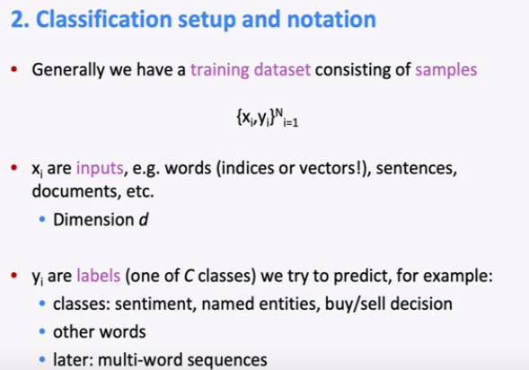

通常我们有一个由样本组成的训练数据集：

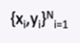

xi 是输入，例如单词（索引或是向量），句子，文档等等，维度为 d

yi是我们将要尝试预测的标签（C个类别中的一个），例如：

类别：情绪，命名实体，买入/卖出的决策

其他单词

之后：多词序列的

**Classification intuition：**

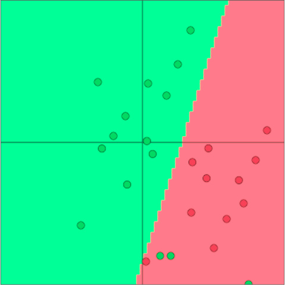

训练数据：

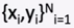

简单的说明案例：

固定的二维单词向量分类

使用softmax/logistic回归

线性决策边界

（单词向量是二维的，使用逻辑回归来进行分类，最后找到线性的决策边界）

传统的ML/统计学方法：假设xi是固定的，训练somtmax/logistic回归的权重W来确定边界。

方法：对于每个X，预测：

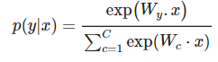

Softmax分类器的详细信息：

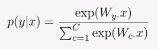

将预测函数分为两个步骤：

1.将W的y行与x中对应行相乘（权重矩阵的某一行乘输入向量的点积）：

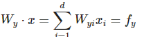

计算所有的fc, c = 1,………,c

2.使用softmax函数得到归一化概率：

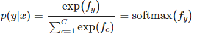

Training with soft and cross-entropy loss（使用softmax与交叉熵损失进行训练）

对于每个训练样本（x，y），我们的目标是最大化正确类y的概率，或是最小化这个类的对数概率：

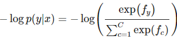

Corss entropy loss/error(交叉熵的损失/误差)

交叉熵”的概念来源于信息论，衡量两个分布之间的差异

令真实概率分布为 p

令我们计算的模型概率为 q

交叉熵为：

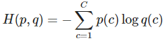

假设 groud truth (or true or gold or
target)的概率分布在正确的类上为1，在其他任何地方为0：p=[0,…,0,1,0,…0]

因为 p 是one-hot向量，所以唯一剩下的项是真实类的负对数概率。

**Classification over a full dataset：**

在整个数据集上的交叉熵损失函数，是所有样本的交叉熵的均值：

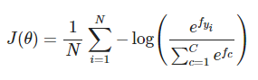

我们不使用

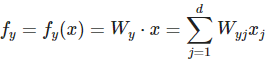

我们使用矩阵来表示f

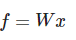

**Traditional ML optimization:**

一般机器学习的参数 θ 通常只由W的列组成

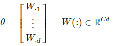

用以下方法来更新决策边界：

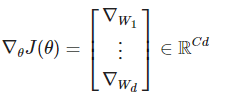

Neural Network Classifiers

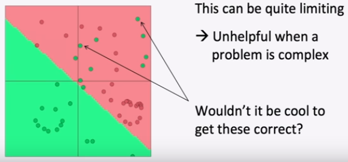

单独使用Softmax(≈logistic回归)并不十分强大

Softmax只给出线性决策边界

Neural Nets for the Win!

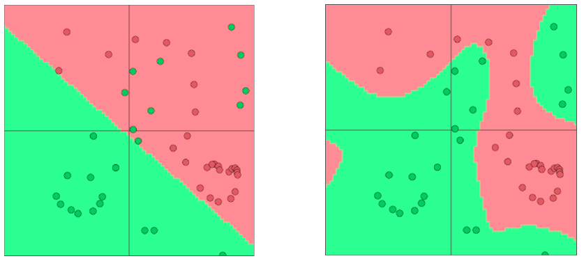

右图为神经网络分类的结果（神经网络可以学习更复杂的函数和非线性决策边界）

**更高级的分类需求**

1.词向量

2.更深层次的深度神经网络

**Classification difference with word vectors：**

一般在NLP深度学习中

1.我们学习了矩阵 W 和词向量 x

2.我们学习传统参数和表示

3.词向量是对独热向量的重新表示——在中间层向量空间中移动它们—以便使用(线性)softmax分类器通过
x = Le
层进行分类，即将词向量理解为一层神经网络，输入单词的独热向量并获得单词的词向量表示，并且我们需要对其进行更新。其中，Vd （非常多的参数）

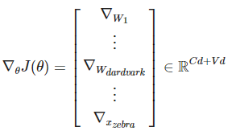

**Neural computation**

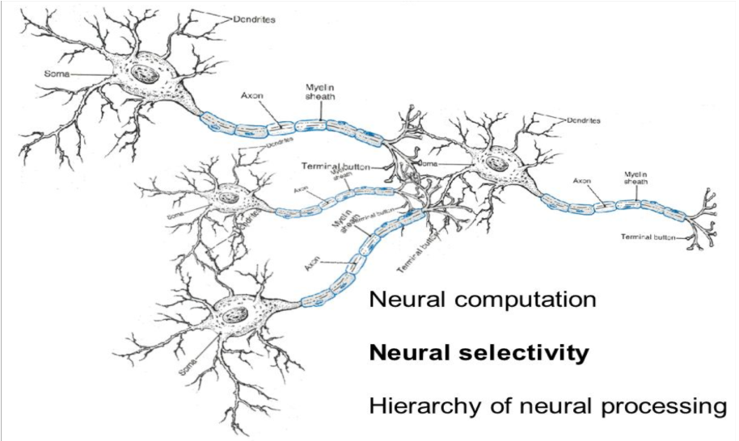

**An artificial neuron：**

神经网络有自己的术语包

但如果你了解 softmax 模型是如何工作的，那么你就可以很容易地理解神经元的操作

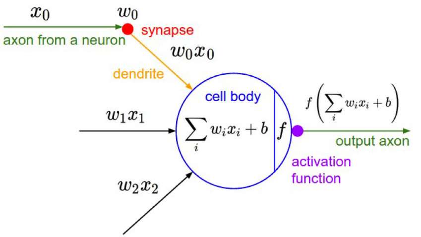

X为输入值，wi为来自各个神经元的权重值，经过激活函数的处理之后，输出传向下一级神经元。

**A neuron can be a binary logistic regression unit：**

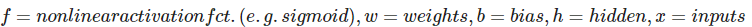

W为权重值，b为偏置，h为隐藏层，x为输入

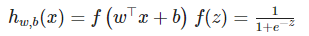

b为：我们可以有一个“总是打开”的特性，它给出一个先验类，或者将它作为一个偏向项分离出来。

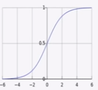

上图为softmax图像

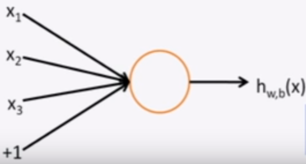

W,b是这个神经元的参数

**A neural network** **= running several logistic regressions at the same
time：**

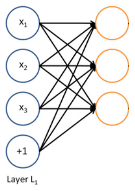

输入一个向量，经过一系列逻辑回归函数，会得到一个输出变量。但是我们不需要提前决定这些函数在预测的变量是什么。

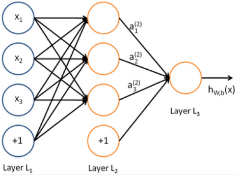

我们只需要把预测结果传递给下一层网络中，由损失函数自动决定它们预测什么，从而传向下一层。

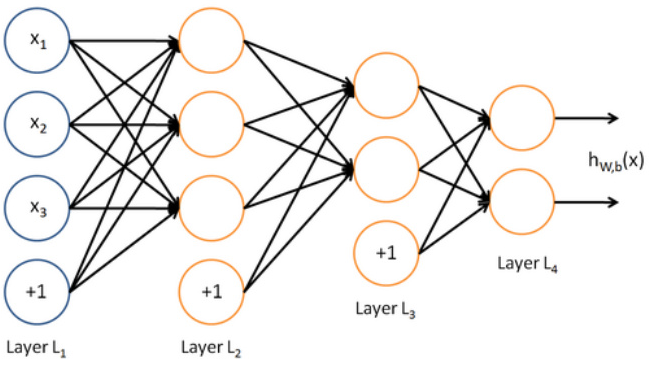

**Matrix notation for a layer：**

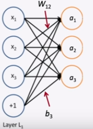

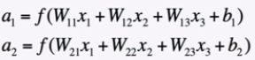

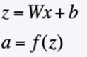

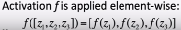

**Non-linearities (aka “f ”): Why they’re needed：**

非线性函数可以更好的捕捉很复杂的数据：

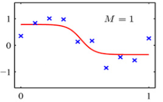

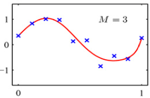

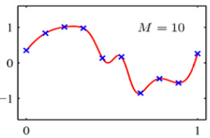

例如：函数近似，如回归或分类

没有非线性，深度神经网络只能做线性变换

多个线性变换可以组成一个的线性变换 W1W2x=Wx

因为线性变换是以某种方式旋转和拉伸空间，多次的旋转和拉伸可以融合为一次线性变换

对于非线性函数而言，使用更多的层，他们可以近似更复杂的函数**Named Entity
Recognition (NER):**

任务：例如，查找和分类文本中的名称

可能的用途

跟踪文档中提到的特定实体（组织、个人、地点、歌曲名、电影名等）

对于问题回答，答案通常是命名实体

许多需要的信息实际上是命名实体之间的关联

同样的技术可以扩展到其他 slot-filling 槽填充 分类

通常后面是命名实体链接/规范化到知识库

**Named Entity Recognition on word sequences**

通过结合上下文中对单词进行分类，然后提取实体单词的子序列来预测。

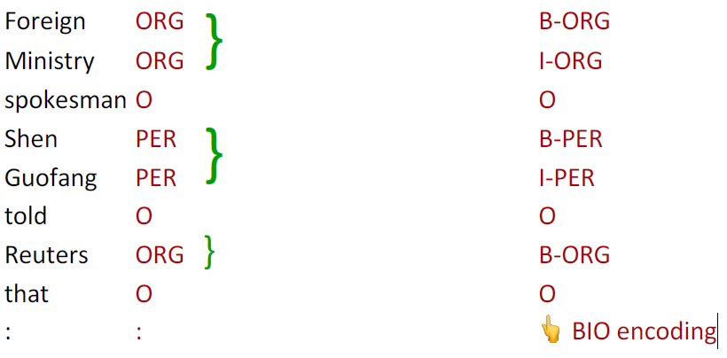

**Window classification**

思想：在\*\*相邻词的上下文窗口\*\*中对一个词进行分类

例如，上下文中一个单词的命名实体分类

人、地点、组织、没有

在上下文中对单词进行分类的一个简单方法可能是对窗口中的单词向量进行\*\*平均\*\*，并对平均向量进行分类

问题：**这会丢失位置信息**

**Window classification: Softmax**

训练softmax分类器对中心词进行分类，方法是在一个窗口内\*\*将中心词周围的词向量串联起来\*\*

例子：在这句话的上下文中对“Paris”进行分类，窗口长度为2

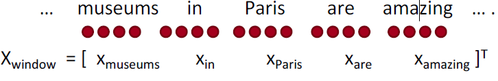

**Simplest window classifier: Softmax**

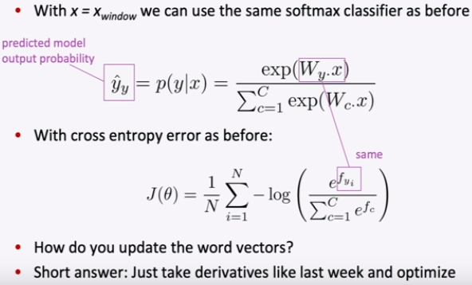

使用softmax分类器

**Binary classification with unnormalized scores**

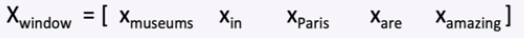

假设我们要对中心词是否为一个地点，进行分类

与word2vec类似，我们将遍历语料库中的所有位置。但这一次，它将受到监督，只有一些位置能够得到高分。

例如，在他们的中心有一个实际的NER Location的位置是“真实的”位置会获得高分。

**Neural Network Feed-forward Computation：**

使用神经激活 aa 简单地给出一个非标准化的分数 ：

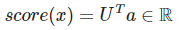

三层神经网络计算窗口得分：

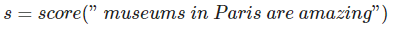

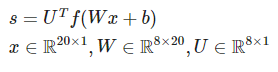

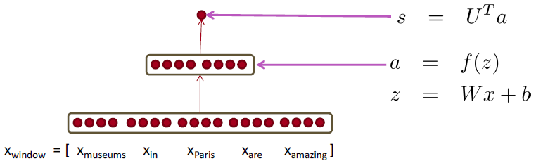

a是激活函数:

**The max-margin loss：**

最小化损失函数，让真实的窗口得分更高，破坏窗口得分更低：

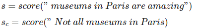

最小化：

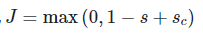

使用SGD更新参数：

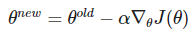

每个中心有NER位置的窗口的得分应该比中心没有位置的窗口高1分：

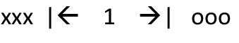

**Jacobian Matrix: Generalization of the Gradient：**

给定一个函数，有m个输出与n个输入：

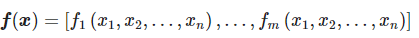

雅可比矩阵可以等效为一个m\*n 的偏导矩阵：

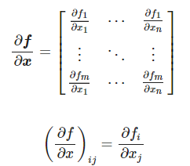

**Chain Rule：**

对于单变量函数：乘以导数：

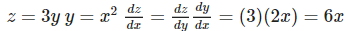

对于一次处理多个变量：乘以雅可比矩阵：

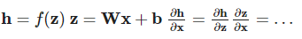

**Example Jacobian: Elementwise activation Function：**

使用element-wise:

函数有n个输入与n个输出=n\*n 的雅可比矩阵

**Other Jacobians：**

上图是正确的雅可比公式，答案为h

**Back to our Neural Net!**

计算分数的梯度

**Break up equations into simple pieces：**

**Apply the chain rule：**

计算过程：

δ是局部误差符号。

**Derivative with respect to Matrix：Output shape：**

∂s/∂W输出形状是

1个输出，n\*m 个输入：1 × n\*m 的雅可比矩阵？

不方便更新参数 

而是遵循惯例：导数的形状是参数的形状 （形状约定）

形状是n\*m

**Derivative with respect to Matrix：**

得到：

δ是局部误差信号;

X是局部输入信号；

**Why the Transposes?**

粗糙的回答是：这样就可以解决尺寸问题了

检查工作的有用技巧

课堂讲稿中有完整的解释

每个输入到每个输出——你得到的是外部积

