# 一. 前言

本章节基于第三讲的命名实体识别 (NER)，而本章节内容讲述其反向传播。前一章的知识点就不多叙述，本章节会直接引用。

# 二. 正篇

反向传播是一种利用微分链式法则来计算模型上任意参数的损失梯度的方法。为了更能容易的理解反向传播，我们先看下图中的一个网络

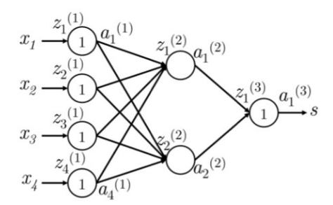

来看一下符号定义:
Xi是神经网络的输入；S是神经网络的输出；每层的神经元都接收一个输入和生成一个输出。第k层的第j个神经元接收标量输入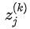和生成一个标量激活输出。我们把反向传播误差在的计算定义为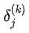。第1层认为是输入层而不是第1个隐藏层。对输入层，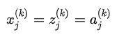。

假设损失函数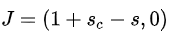为正值，我们想更新参数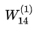，我们看到只参与了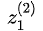和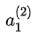的计算。这点对于理解反向传播是非常重要的-参数的反向传播梯度只和参与了前向计算中的参数的值有关系，在随后的前向计算中和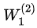相乘计算得分。我们可以从最大间隔损失看到：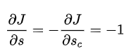

### 偏置更新

偏置项和其他权值在数学形式是等价的，只是在计算下一层神经元输入时相乘的值是常量1。因此在第k层的第i个神经元的偏置的梯度时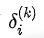。例如在上面的例子中，我们更新的是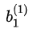而不是，那么这个梯度为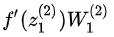。

我们有从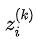向后传播的误差，如下图所示

我们通过把与路径上的权值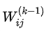相乘，将这个误差反向传播到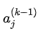。因此在接收的误差是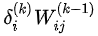。然而，在前向计算可能出下图的情况，会参与下一层中的多个神经元的计算。那么第k层的第m个神经元的误差也要使用上一步方法将误差反向传播到上。

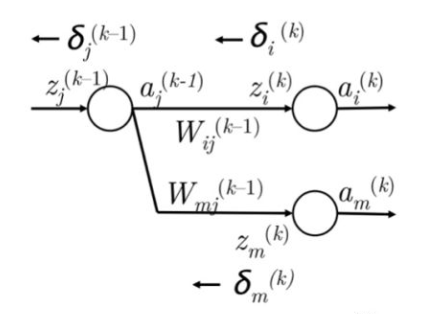

因此现在在接收的误差是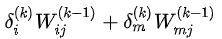。实际上，我们可以把上面误差和简化为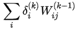。现在我们有在接正确的误差，然后将其与局部梯度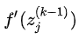相乘，把误差信息反向传到第k-1层的第j个神经元上。因此到达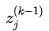的误差为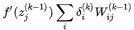。

## Dropout层

Dropout是一种强大的正则化技术。在训练过程中，以一定的概率随机“丢弃”一个子集。然后在测试过程中，使用整个网络来预测。这样网络通常能从数据中学习更有意义的信息，不太可能过拟合，且通常能获得更高的整体性能。这种技术之所以如此有效一个直观的原因是，dropout所做的，本质上是同时训练成指数级的许多较小的网络，并对预测进行平均。引入dropout的方法：取每一层神经元的输出h，并保持每个神经元的概率为p，否则将其设置为0。然后，在反向传播过程中，只通过在正向传播过程中保持活性的神经元传递梯度。最后，在测试过程中，用网络中的所有神经元来计算正向传递。为了让dropout有效，预期的输出神经元在测试期间应该差不多。因此，通常必须在测试期间将每个神经元的输出除以某个值。

## 神经单元

包含sigmoid的神经网络，以引入非线性。在许多应用中，可以使用其他激活函数来设计网络。

### sigmoid

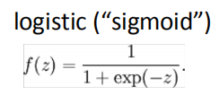

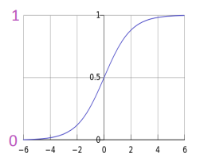

### Tanh

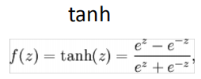

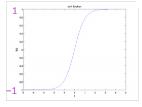

### Hard tanh

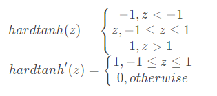

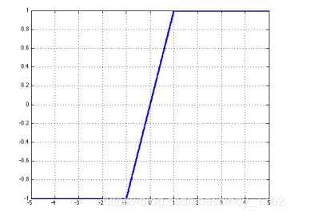

## ReLU

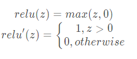

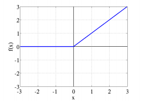