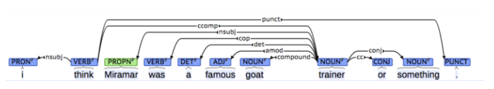
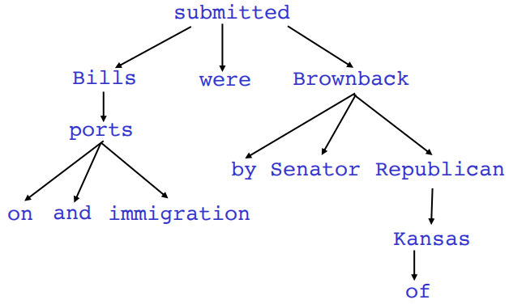
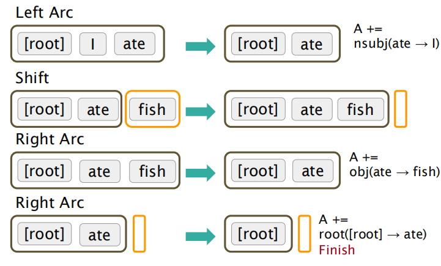
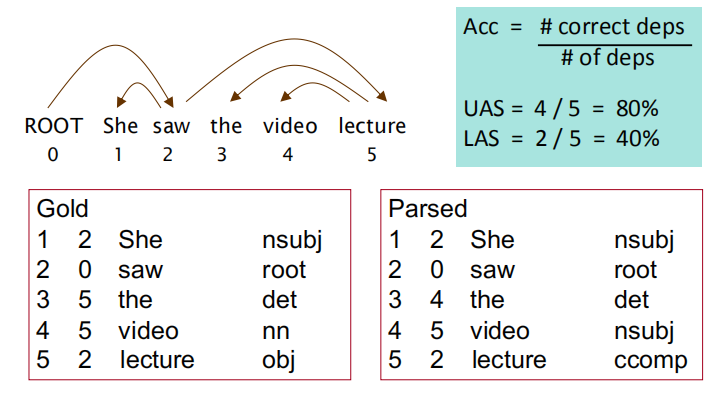
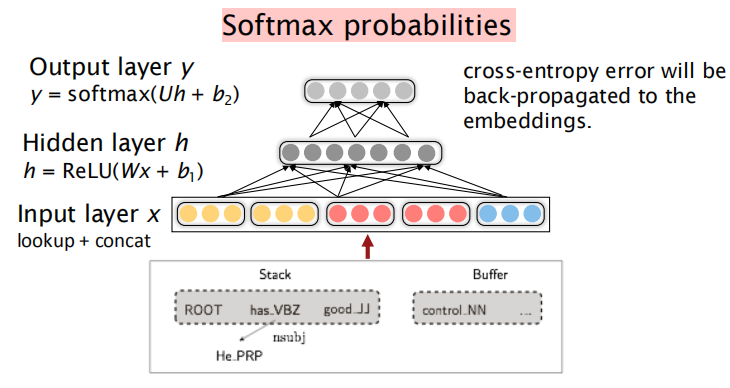

# 一. 前言

本章节讲述了对于句法结构分析，其主要有两种方式：Constituency Parsing和Dependency Parsing。本章节主要对后者进行了详细的表述。

# 二. Dependency Parsing

## 基本概念

Dependency Structure展示了词语之前的依赖关系,其有两种表现形式，一种是用箭头表示其依存关系，有时也会在箭头上标出其具体的语法关系，如是主语还是宾语关系等。

二是将其做成树状机构 (Dependency Tree Graph)

Dependency Parsing可以看做是给定输入句子S = W0·W1...Wn构建对应的Dependency Tree Graph的任务。一个有效构建这个树的方法是Transition-based Dependency Parsing。

## Transition-based Dependency Parsing

Transition-based Dependency Parsing可以看做是state machine，对于S = W0·W1...Wn，state有三部分组成 (θ，β，A)。θ是S中若干Wi构成的stack。β为S中若干Wi构成的buffer。A则是dependency arc 构成的集合，每一条边的形式是 (Wi，r，Wj)，其中r描述了节点的依存关系。
state之间的transition有三类：

1.SHIFT：将buffer中的第一个词移出并放到stack上。

2.LEFT-ARC：将(Wi，r，Wj)加入边的集合A，其中Wi是stack上的次顶层的词,Wj是stack上的最顶层的词。

3.RIGHT-ARC:将(Wi，r，Wj)加入边的集合A，其中Wi是stack上的次顶层的词，Wj是stack上的最顶层的词。

不断的进行上述三类操作，直到从初始态达到最终态。当我们考虑到LEFT-ARC与RIGHT-ARC各有|R|（|R|为r的类的个数）种class，我们可以将其看做是class数为2|R|+1的分类问题，可以用SVM等传统机器学习方法解决。

## 评估

当我们有了Dependency Parsing的模型后，就开始着手准备评估。我们有两个metric，一个是LAS（labeled attachment score）即只有arc的箭头方向以及语法关系均正确时才算正确，以及UAS（unlabeled attachment score）即只要arc的箭头方向正确即可。

图示为LAS

## Neural Dependency Parsing

对于Neural Dependency Parser，其输入特征通常包含三种：
1.stack和buffer中的单词及其dependent word，我们基于stack/buffer的位置来提取令牌。

2.我们将其转换为向量并将它们联结起来作为输入层，再经过若干非线性的隐藏层，最后加入softmax layer得到每个类的概率。

利用这样简单的前馈神经网络，我们就可以减少feature engineering并提高准确度。