# 一. 前言

第六章主要探讨了语言模型以及循环神经网络在语言模型中的应用。

语言模型计算特定序列中多个单词的出现概率。一个m个单词的序列{W1,...,Wn}的概率定义为P(W1,...,Wn)。句子中一个单词的之前会有一定是数量的单词，单词Wi的特性会根据它在文档中的位置而改变，P(W1,...,Wn)一般只考虑前n个单词而不是考虑全部之前的单词。

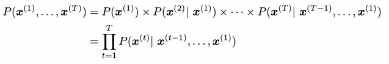

# 二. 经典语言模型

## n-gram模型

n-gram的定义就是连续的n个单词。对于the students opened their __ 这段话，把这段话分成连续的几部分：

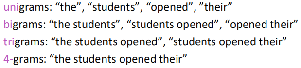

以此类推。该模型的核心思想是n-gram的概率应正比于其出现的频率，并且假设P(Xt+1)仅仅依赖于它之前的n-1个单词，即，

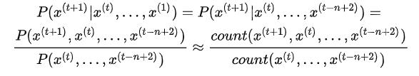

其中count是通过处理大量文本对相应的n-gram出现次数计数得到的。

但这个模型有两个主要问题：稀疏性和存储。

1.稀疏问题：Sparsity Problem。在我们之前的大量文本中，可能分子或分母的组合没有出现过，则其计数为零。并且随着n的增大，稀疏性更严重。

2.必须存储所有的n-gram对应的计数，随着n的增大，模型存储量也会增大。

这些限制了n的大小，但如果n过小，则我们无法体现稍微远一些的词语对当前词语的影响，这会极大的限制处理语言问题中很多需要依赖相对长程的上文来推测当前单词的任务的能力。

## Window-based Neural Language Model

这个模型能够通过学习单词的分布式表示，以及用这些表示来表示单词的概率函数。下图展示了对应的神经网络结构，在这个模型中，输入向量在隐藏层和输出层中都被使用。

神经网络结构图

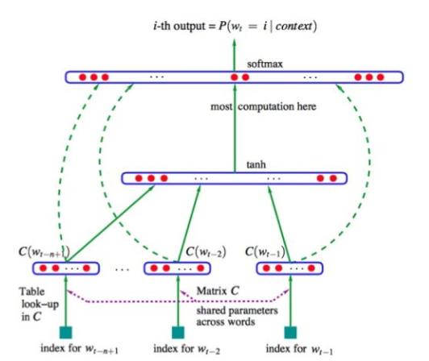

下面公式展示了由标准 tanh 函数(即隐藏层)组成的 softmax 函数的参数以及线性函数W3x+b3，捕获所有前面n个输入词向量。

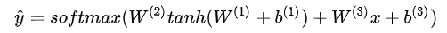

权值矩阵W1是应用在词向量上(上图中的绿色实线箭头)，W2是应用在隐藏层(也是绿色箭头)和W3是应用在词向量(绿色箭头)。

与n-gram模型相比较，它解决了稀疏问题与存储问题，但它仍然存在一些问题：窗口大小固定，扩大窗口会使矩阵W变大，且X1，X2与W的不同列相乘，没有任何可共享的参数。

简化版网络结构图

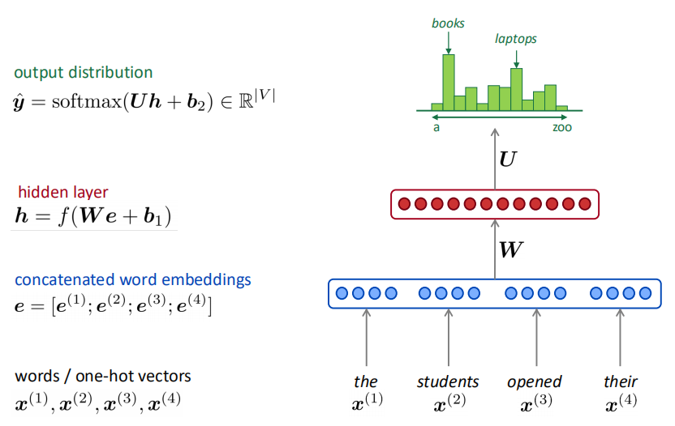

## Recurrent Neural Networks (RNN)

传统的翻译模型只能以有限窗口大小的前n个单词作为条件进行语言模型建模，循环神经网络与其不同，RNN 有能力以语料库中所有前面的单词为条件进行语言模型建模。其基本结构如下图所示：

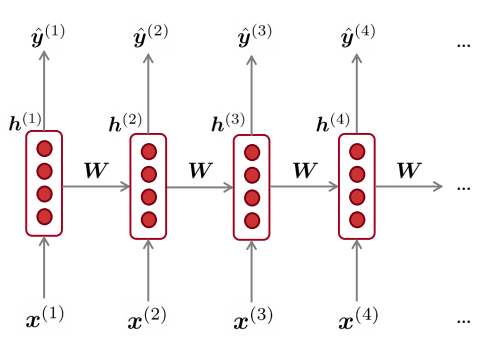

每个这样的隐藏层都有若干个神经元，每个神经元对输入向量用一个线性矩阵运算然后通过非线性变化（例如 tanh 函数）得到输出。在每一个时间步，隐藏层都有两个输入：前一个时间步的隐藏层ht-1和当前时间步的输入Xt，前一个时间步的隐藏层ht-1通过和权值矩阵W(hh)相乘和当前时间步的输入Xt和权值矩阵W(hx)相乘得到当前时间步的隐藏层ht，然后再将ht和权值矩阵W(s)相乘，接着对整个词表通过softmax计算得到下一个单词的预测结果y^，如下面公式所示：

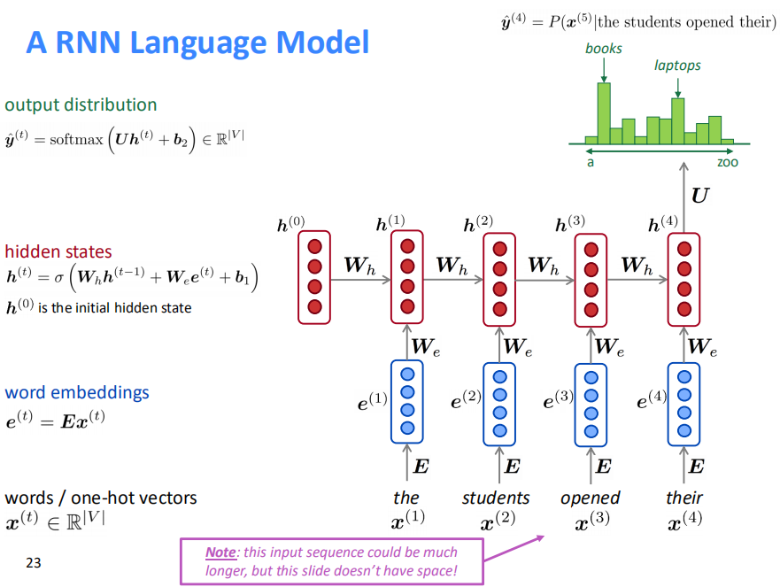

RNN的训练过程同样依赖于大量的文本，在每个时刻t计算模型预测的输出y(t)与真实值y^(t)即X(t+1)的cross-entropy loss，即

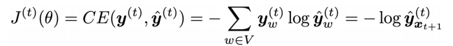

对于文本量为T的总的损失即为所有交叉熵损失的平均值：

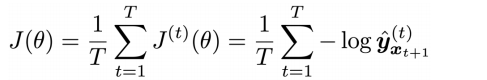

每个神经元的输入和输出如下图所示：

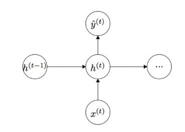

图示为RNN模型

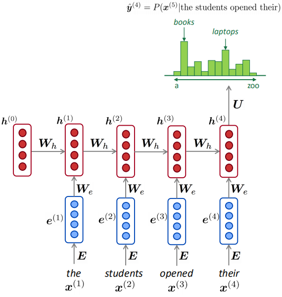

模型评估指标

### 总结

RNN 有以下优点：

1.它可以处理任意长度的序列。

2.对更长的输入序列不会增加模型的参数大小。

3.对时间步 t 的计算理论上可以利用前面很多时间步的信息。

4.对输入的每个时间步都应用相同的权重，因此在处理输入时具有对称性。

RNN 有以下缺点：

1.计算速度很慢-因为它每一个时间步需要依赖上一个时间步，所以不能并行化。

2.在实际中因为梯度弥散和梯度爆炸，很难利用到前面时间步的信息。