一 NLP深度学习的过去
====================

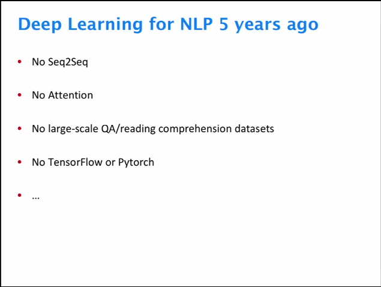

很多被现在认为非常核心技术的想法在当时是不存在的，如Seq2Seq、注意力机制、大规模问答系统/阅读理解数据集，甚至是TonsorFlow或Pytorch等框架。

**Seq2Seq**

seq2seq 是一个Encoder–Decoder 结构的网络，它的输入是一个序列，输出也是一个序列，
Encoder 中将一个可变长度的信号序列变为固定长度的向量表达，Decoder
将这个固定长度的向量变成可变长度的目标的信号序列。

**Attention**

Attention函数的本质可以被描述为一个查询（query）到一系列（键key-值value）对的映射。

二 NLP深度学习的未来
====================

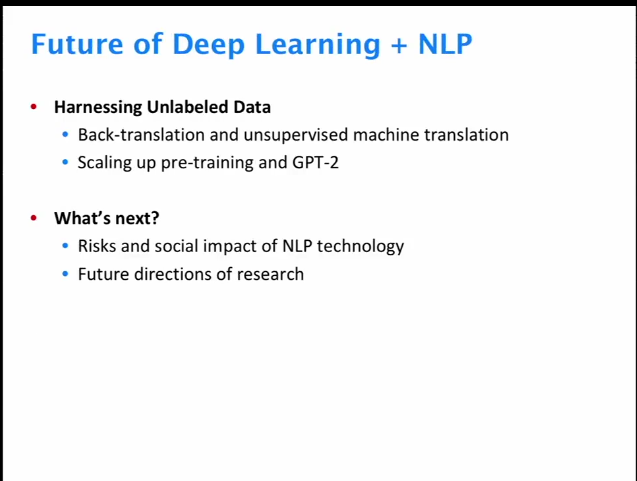

1、本课程的关键思想：在训练NLP系统时利用未标记的例子。

2、扩大规模的深度学习模型OpenAl和GPT-2

3、NLP的社会影响

4、NLP在未来的研究领域发挥的重要作用

三 深度学习的发展
=================

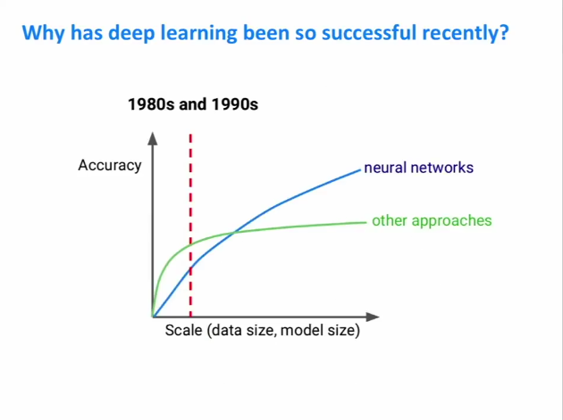

近年来，深度学习发展迅速关键在于其扩展能力的提高，增加模型的大小和相关数据集，其准确性得到极大的提升。在80年代和90年代，就有很多关于神经网络的研究。

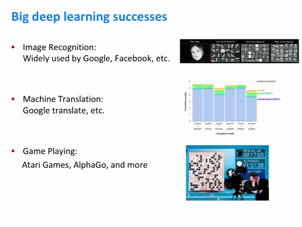

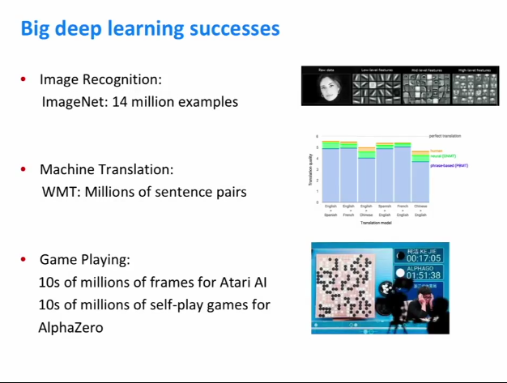

深度学习在图像识别、机器翻译以及游戏。因此，对于ImageNet，对于图像识别，ImageNet数据集有1400万个图像，机器翻译数据集通常有数百万个例子。对于游戏，实际上可以生成尽可能多的训练数据，只需在游戏中一遍又一遍地运行代理即可。

四 NLP数据集
============

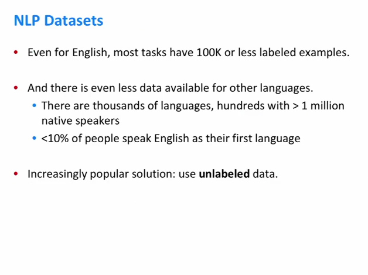

NLP数据存在的原因**只适用于英语**。

绝大多数数据是英语，实际上不到世界人口的10％，说英语是他们的第一语言。因此，如果您查看存在的全部语言，那么小数据集的这些问题才会复杂化。

因此，当受到这些数据的限制时，希望利用深度学习规模并训练最大的模型。最近成功的**流行解决方案是使用未标记的数据**。因为与标记数据不同，语言非常容易获取。在某些情况下，甚至可以要求像语言学这样的专家来注释该数据。

五 使用未标记的数据进行翻译
===========================

应用利用未标记数据的想法，将NLP模型改进为机器翻译任务。

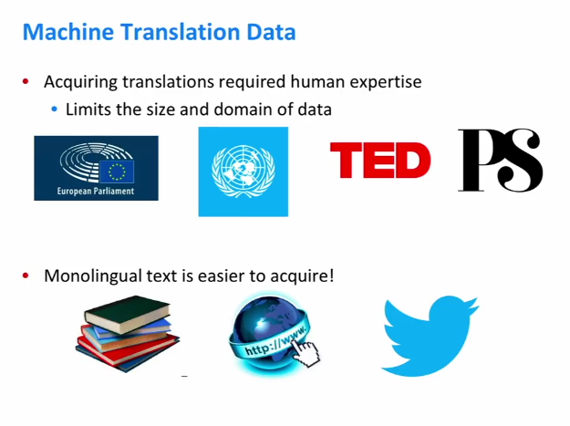

机器翻译确实需要相当大的数据集。而这些数据集是NLP研究人员为了训练其模型而注释了文本，训练模型受到标记数据的限制，但我们可以很容易找到未标记的数据，准确地查看一些文本并决定它所使用的语言并训练分类器来做到这一点。

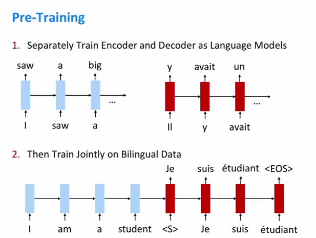

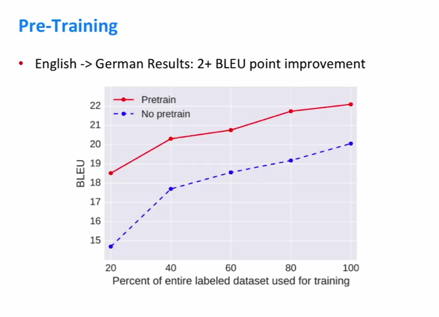

**预训练**

预训练——通过语言建模来预训练。

将从一种语言翻译为另一种语言，需要为这两种语言收集大型数据集，然后训练两种语言模型，每种语言模型一次，最后使用那些预先训练的语言模型作为机器翻译系统的初始化。

编码器对输入语言进行检测，同时对其语言模型的权重进行初始化，而解码器对目标语言模型的权重进行初始化，这将提高模型的性能。

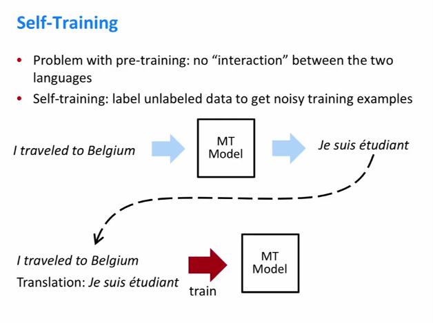

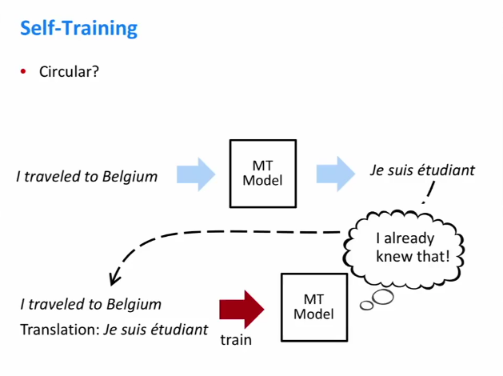

预训练的问题——预训练中，两个独立的语言模型在未标记的语料库上运行时，两者之间从未真正进行任何交互。

**自我训练**

将原始的单语句和机器提供的翻译视为人为提供的翻译，并在此示例中正常训练机器学习模型。

**反向翻译**

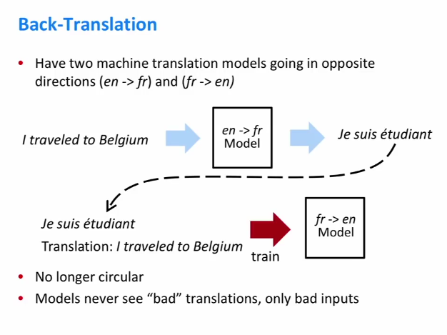

翻译系统从源语言到目标语言，还将训练从目标语言到源语言的模型。

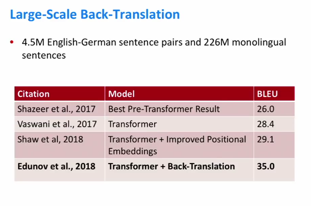

这是来自Facebook的英语到德语的翻译，他们使用了500万个带标签的句子对，也使用了230个没有翻译的单语句子。你可以看到，与以前的技术水平相比，如果你将它与之前的研究和机器转机翻译进行比较，它们可以获得6个BLEU点改进。
