一 双语数据
===========

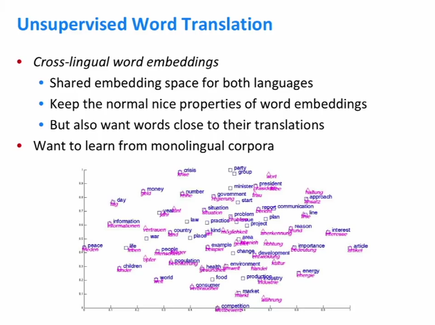

这里的目标是用一种语言给出一个单词，找到它的翻译，但不使用任何标记数据。

尝试解决此任务的方法称为**跨语言嵌入**。

目标是学习两种语言中单词的单词向量，希望这些单词向量具有已经学过的有关单词向量的所有好的属性，同时也希望特定语言的单词向量能够接近到它的翻译的单词矢量。

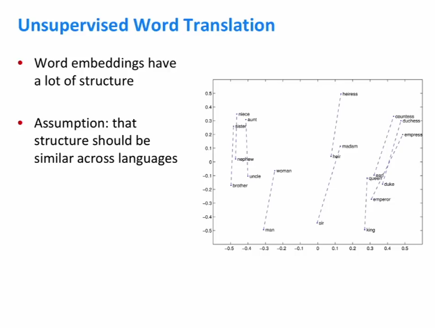

解决这个问题的关键方法：**word2vec**

**嵌入空间的结构具有很多规律性，利用这种规律性来帮助找到那些嵌入空间之间的对齐**。

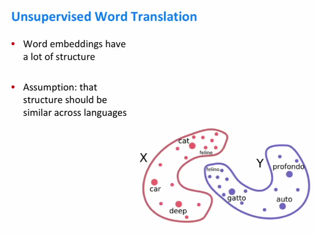

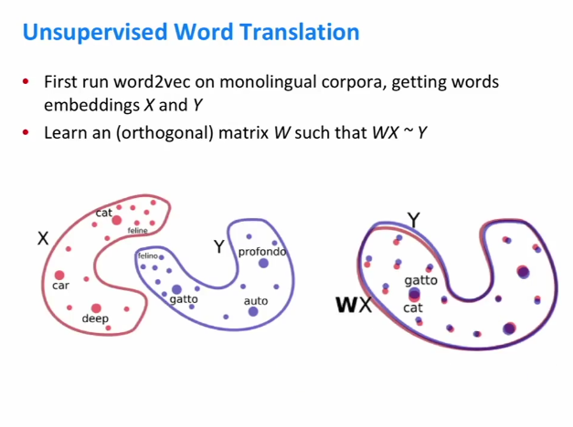

这是两组字嵌入的图片，红色有英文单词，蓝色有意大利语单词。虽然现在的矢量空间看起来彼此非常不同，但是看到它们有一个非常相似的结构。尝试将转换的英语嵌入集旋转，以便它们与意大利嵌入相匹配。

从数学上来说，这意味着需要一个学习矩阵W，用英语中的cat表示矢量，我们将它乘以W，最终得到西班牙语或意大利语的gatto矢量。将W约束为正交，这意味着几何上W只会对X中的向量进行旋转。

二 如何学习W
============

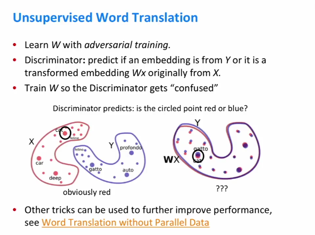

实际上有很多技术可以用来学习这个W矩阵，其中一个就是称为**对抗训练**。

它的工作方式如下：

除了试图学习W矩阵之外，还将尝试学习一个被称为鉴别器的模型。采用一个向量，预测该向量最初是英文单词嵌入还是原来是意大利语嵌入。

如果没有W矩阵，这对于鉴别器来说是一个非常简单的任务，清楚地分开英语和意大利语的嵌入字。如果学习W矩阵成功地将所有这些嵌入对齐，那么鉴别器将永远不会做得很好。

在训练期间，首先要稍微训练一下鉴别器，这意味着确保它在区分英语和意大利语单词时尽可能好，然后训练W，而训练W的目标是将鉴别器混淆为尽可能多。

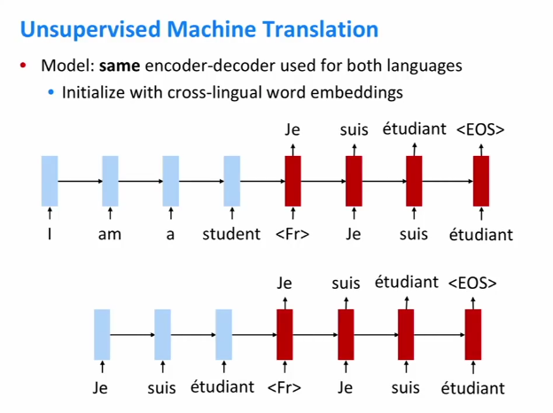

**seq2seq模型**

对标准的seq2srq模型进行了一处更改，即我们将使用相同的编码器和编码器，无论输入和输出语言如何。它将具有英语单词和法语单词的向量表示。

对于解码器，我们需要给它一些关于它应该生成什么语言的信息。这样做的方法是输入一个特殊的标记，这个标记在括号中表示告诉模型的语法。在底部，它输入法语句子作为输入，它只是生成法语作为输出，这意味着只是再现原始输入序列。

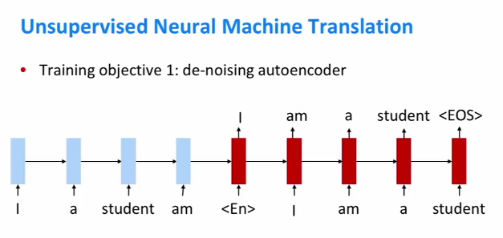

三 如何训练seq2seq模型
======================

去噪自动编码器

它被扰乱之前重新生成句子实际上是什么。也许有一个想法为什么这将是一个有用的训练目标，是因为有一个没有注意的编码器-解码器。编码器正在将整个源句子转换成单个向量，自动编码器做的是确保向量包含有关句子的所有信息，以便能够从编码器产生的向量中恢复原始句子的内容。

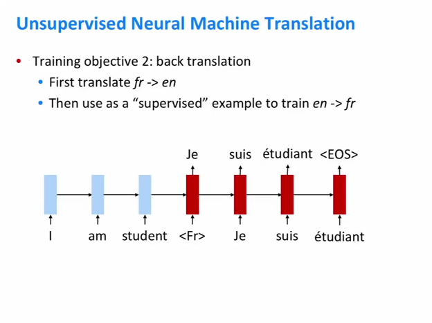

用没有标签的句子，不提供任何人工翻译，假设一个英语句子或者说一个法语句子，给出一个法语句子，可以将它翻译成英语，使用模型的当前状态，然后要求该模型从英语翻译或将该英语翻译回法语。

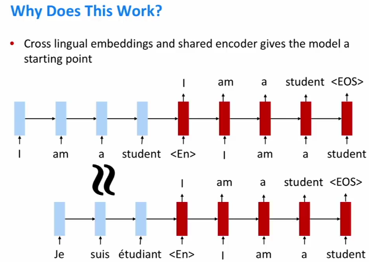

使用这些跨语言嵌入来初始化机器翻译模型使用共享编码器。在顶部，只有一个自动编码目标，由于嵌入看起来非常相似，并且因为编码器是相同的，所以模型对这个法语句子的表示实际上应该与英语句子的表示非常相似。因此，当这种表示传递到解码器时，我们希望获得与以前相同的输出。

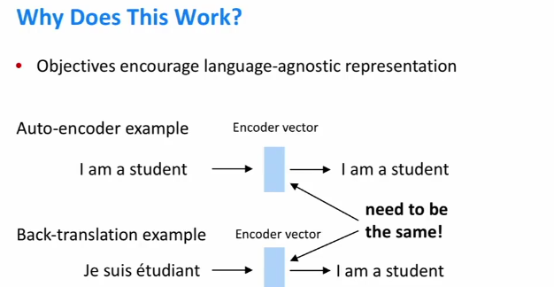

另一种思考方式是希望我们的模型能够对句子进行编码，这样表达式就像是一种通用的国际语言。我们的自动编码器和我们的反向翻译示例中，这里的目标序列是相同的。

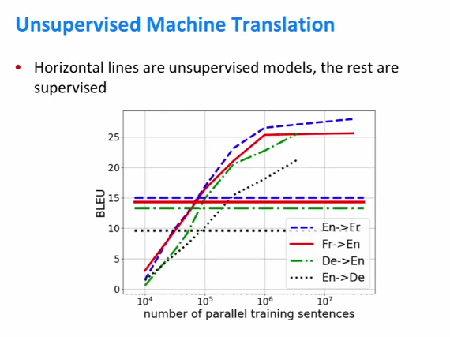

毫无疑问，在给定大量监督数据的情况下，受监督的机器翻译模型比无监督的机器翻译模型工作得更好。但是无监督的机器翻译模型实际上仍然做得很好。

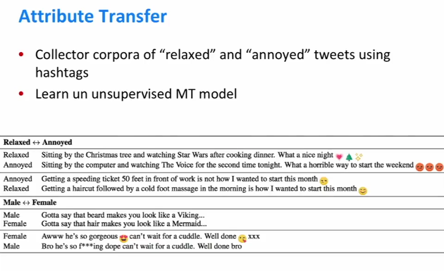

使用无监督机器翻译模型可以做的另一件好事是**属性转移**。

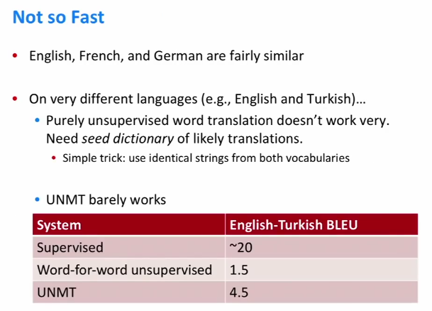

因此，如果你看一个不同的语言对，让我们说英语到土耳其语，这两种语言的语言学是完全不同的，这些方法在某种程度上仍然有效，所以他们可以说五个BLEU点，但他们不会几乎和其他设置一样工作。

纯粹的监督学习仍然存在巨大差距。
