一 BERT
=======

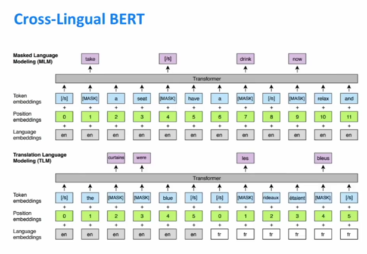

这是常规BERT，使用英语一些句子（其中某些单词被删除），要求使用BERT模型来填补空白并预测这些单词。

谷歌实际上已经完成了多语言BERT训练。采用的是连接一大堆不同语言的语料库，然后训练一个模型在所有语言上使用模型。最近，由Facebook提出的这种新的扩展，实际上是将LM培训目标与翻译相结合。

在这种情况下，给这个模型一个英文序列和一个法语序列，删除一些单词，要求模型填写它，更好地使模型理解两种语言之间的关系。

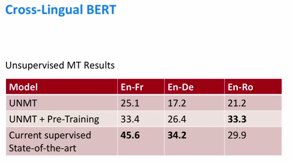

因此像BERT用于NLP中的其他任务一样，基本上都采用这种跨语言BERT，将其用作无监督机器翻译系统的初始化，并获得了大约10个BLEU点的增益，这样就可以实现无人监督的机器翻译。

二 Huge Models and GPT-2
========================

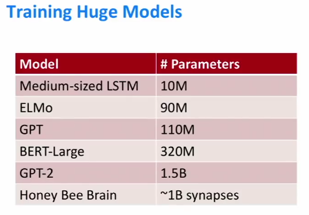

首先，这是一些不同大小的NLP模型，也许几年前标准的LSTM中型模型大约有1000万个参数。在OpenAl论文之前，这个GPT-2大约是它的10倍，大约相当于另一个数量级。当然，、神经网络中的突触和权重是完全不同的。

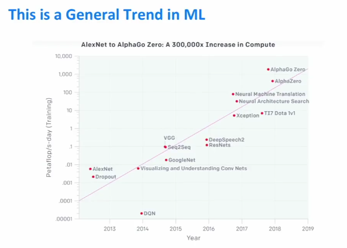

该图显示了x轴是时间，y轴是用日志来衡量用于训练该模型的petaFLOPS的数量。这意味着至少目前的趋势是机器学习模型的计算能力呈现出指数增长。

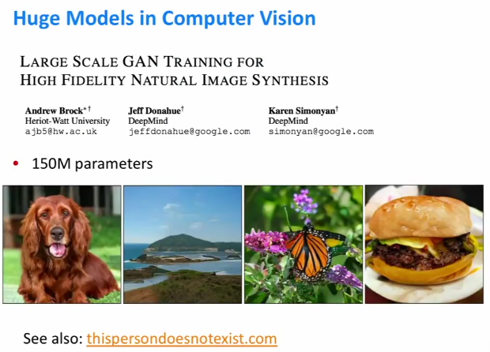

这结果来自一个视觉的生成性对抗网络，它已经在很多数据上进行了训练，并且已经在大规模上进行了训练，这是ELMo和BERT之间的大型模型。如果你感兴趣的是https://thispersondoesnotexist.com/。

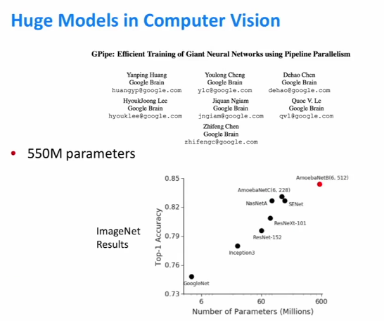

这是谷歌最近的工作，他们训练了一个有5亿个参数的图像网络模型。这里的图表显示x轴上的日志缩放参数数量，然后ImageNet在y轴上的准确性，这种大型模型表现得更好。并且似乎成为一种趋势，其精度随着模型尺寸的对数而增加。

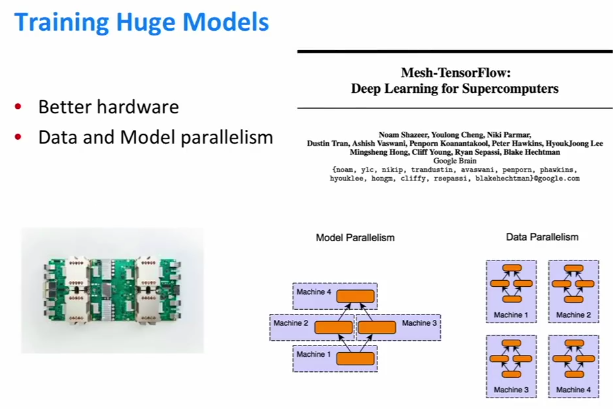

硬件在很大程度上扩展模型和训练模型。特别是，越来越多的公司正在开发深度学习的硬件。实际上另一种扩展模型的方法是利用并行性。

一种是数据并行性。在这种情况下，GPU将拥有该模型的数据副本，将正在训练的数据分成小批量到这些模型中，这样就可以更快地训练模型。

另一种并行性是模型并行性。在这种情况下，您实际上需要将模型拆分为多个计算单元。

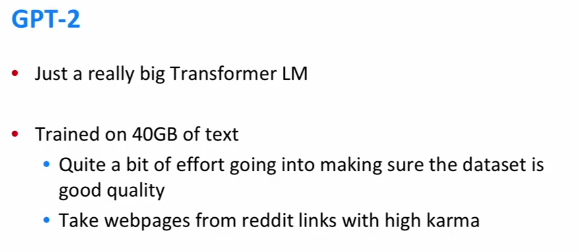

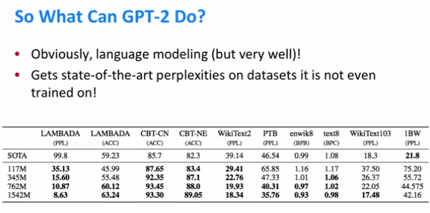

拥有像GPT-2这样超级庞大的语言模型，可以用它进行语言建模。并在基准测试上运行这种语言模型。如果想评估语言模型，首先在Penn
Treebank上训练，然后评估这个组合。在这种情况下，GPT-2只是因为看过这么多的文字并且是如此大的模型，优于其他的先前，即使它没有那些数据也能在不同的语言基准中测试。

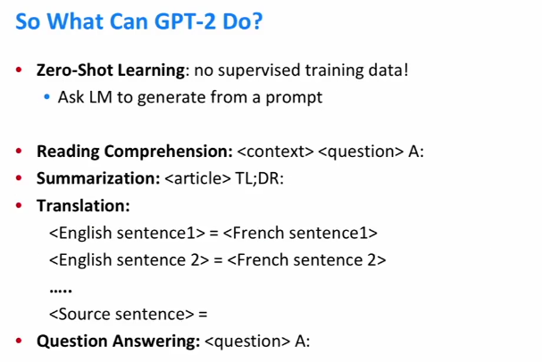

零射击学习只是尝试完成一项任务，而不需要对它进行训练。通过设计一个提示需要输入的语言模型，然后让它从那里生成，希望它生成与你想要解决的任务相关的语言。

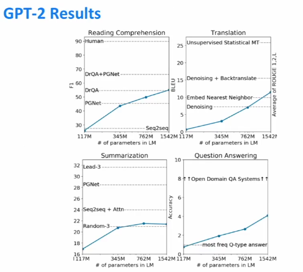

x轴是对数缩放的模型大小，y轴是精确度，虚线基本上对应于这些任务的现有工作。

通常在NLP的历史中，如果想将一种世界知识带入一个NLP系统，你需要一个类似于事实的大数据库，它仍然可以通过阅读大量文本而无需明确地获取一些世界知识将这些知识付诸于模型。
